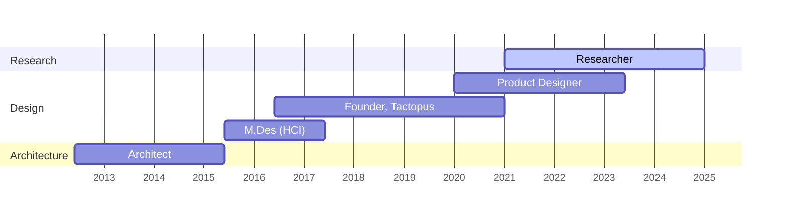

![[github doodle.png]]
Hi, I'm **Chandni Naidu Deadwyler**. 
Welcome to my website.
### About Me
*Designer, researcher, writer, artist.*
I'm a systems-thinker who spent the larger part of her career building in EdTech, FinTech, and currently researching and writing about financial inclusion as a design justice issue. My research process is artefact-led, driven by realities of technology impact on society. 
###  Current responsibilities:
- [Dialectic](https://dialectic.in/): I research, analyse, visualise and write essays about public-interest topics. You can sign up to the [newsletter](https://dialecticstudio.substack.com/) for updates on the latest stories. *Please [write to me](mailyo:alias.bright712@passinbox.com) if you're available to collaborate on upcoming projects.*
- Consulting for product teams on data-driven product design, research and communication. I write about some of them on this site. Check under [[Articles]]
- Independent projects: a compilation of HCI research methods, and resource discovery platform for special education needs.

> [!quote] News
> I spent the last quarter of 2024 in the most indulgent way I could imagine - earning a MicroMasters degree in [[Data, Economics and Design of Policy]] offered by MIT's Department of Economics. It was a rich learning experience, and 100% responsible for moving my analytical work from Excel to R - A gigantic upgrade, I'd say.

### Background
Summary of educational and professional journey:

```mermaid
	gantt
	
    dateFormat  YYYY-MM-DD
    axisFormat %Y
    excludes    weekends
    todayMarker stroke-width:2px,stroke:#4060ef,opacity:0.5
    section Research
        Researcher         :active, 2021-01-01, 2025-01-01
    section Design
        Product Designer   :2020-01-01, 2023-06-01
	    Founder, Tactopus  :2016-06-01, 2021-01-01
        M.Des (HCI)        :2015-06-01, 2017-06-01
    section Architecture
	    Architect         :2012-06-01, 2015-06-01
```
---

![[Bookshelf illustration 2.png]]
### [[content/Pages/Bookshelf.md|My Bookshelf]] 
Recent reads and recommendations

> [!quote] Art Shop
> ✨  [Whalesong](https://whalesong.printify.me/products) 
I create art quite regularly, but update the store sporadically. You can sign up [here](https://whalesongstudio.substack.com/) to be updated about new products.

---
> [!note] Site Notes
> I recently moved my work to an Obsidian-Quartz-GitHub set up. This change is motivated by some developments in how I document and share my work. I made the choice to avoid creating a "design portfolio", and build more of a collection of thoughts and ideas I believe may be valuable to some people. The contents of this site are organised into one of these two categories, usually Notes building up to Articles over time.
>>>[!todo] [[Articles]]
>
>>>[!todo] [[Daily Notes]]
